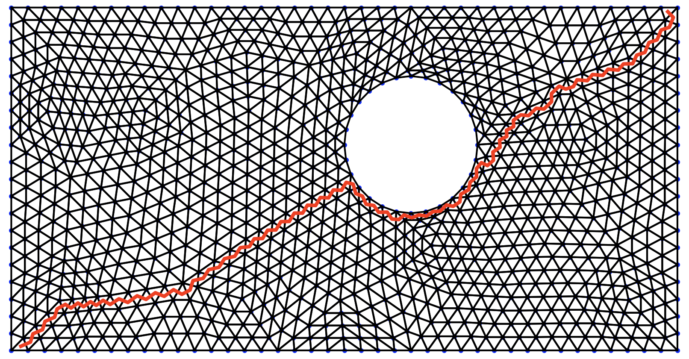

# Astar — Pathfinding on 3D Meshes (C++17 + nanobind)

Lightweight C++17 library implementing a **pathfinding (A\*)** algorithm on 3D triangular meshes, with an optional Python binding via **nanobind**. The core exposes primitives (`Vertex`, `Face`, `Mesh`, …) and the **`find_best_path`** function.



---

## Table of Contents

1. [Overview](#overview)  
2. [Main Structures & API](#main-structures--api)  
3. [Repository Layout](#repository-layout)  
4. [Prerequisites](#prerequisites)  
5. [Build (C++ library, GoogleTest, Python binding)](#build-c-library-googletest-python-binding)   
8. [Usage Examples](#usage-examples)  
   - [C++](#c)  
   - [Python](#python)

---

## Overview

The project provides:

- **Basic types**: `Vertex = std::array<float,3>`, `Face = std::array<std::size_t,3>`, `Mesh`, `Path`,
- **Graph utilities** (connectivity/edges) to build adjacency,
- A configurable **heuristic** (`std::function<float(const Vertex&, const Vertex&)>`),
- And **`find_best_path`** (A\*) to return an optimal path on the mesh.

---

## Main Structures & API

### Types

```cpp
using Vertex   = std::array<float, 3>;
using Face     = std::array<std::size_t, 3>;
using Vertices = std::vector<Vertex>;
using Faces    = std::vector<Face>;

struct Path {
    std::vector<std::size_t> steps;       // indices of visited vertices
    std::optional<Vertices>  vertices;    // path vertices (optional)
};

struct Mesh {
    Vertices vertices;
    Faces    faces;
};

struct Heuristics {
    // distance(a, b) -> float estimate
    std::function<float(const Vertex&, const Vertex&)> distance;
};

struct Barycenter {
    std::size_t face;
    std::array<float, 3> weights;         // barycentric weights (sum = 1)
};

// Path endpoints: either two vertex indices OR two barycenters
using Ends = std::variant<
    std::pair<std::size_t, std::size_t>,
    std::pair<Barycenter, Barycenter>
>;
```

### Function

```cpp
Path find_best_path(const Mesh& mesh,
                    const Heuristics& heuristics,
                    const Ends& ends,
                    const bool retrieve_vertices = false);
```

- `retrieve_vertices=true` fills `Path::vertices` with the coordinates of the path vertices.
- `Ends` lets you specify endpoints **on vertices** or **inside faces** (barycenters).

---

## Repository Layout

```
├── CMakeLists.txt 
├── benches 
│ ├── bench_python.py 
│ ├── mesh_display.py 
│ └── path_display.py 
├── cmake 
│ └── AstarConfig.cmake.in 
├── include 
│ └── astar 
│ ├── astar.h 
│ ├── connectivity_map.h 
│ ├── edge_map.h 
│ ├── face.h 
│ ├── heuristics.h 
│ ├── mesh.h 
│ ├── norms.h 
│ ├── path.h 
│ └── vertex.h 
├── python_package 
│ ├── CMakeLists.txt 
│ └── bindings.cpp 
├── readme.md 
├── src 
│ ├── CMakeLists.txt 
│ ├── astar.cpp 
│ ├── connectivity_map.cpp 
│ ├── edge_map.cpp 
│ ├── heuristics.cpp 
│ └── norms.cpp 
└── tests 
├── CMakeLists.txt 
├── astar_test.cpp 
├── connectivity_map_test.cpp 
├── edge_map_test.cpp 
├── helpers.cpp 
├── helpers.h 
├── heuristics_test.cpp 
└── norms_test.cpp.
```

> The Python bindings are isolated under `python_package/` and link against the C++ library built from `src/`.

---

## Prerequisites

- **C++17** (recent Clang, GCC, or MSVC)  
- **CMake ≥ 3.16**  
- (For the Python module) **Python ≥ 3.8**, **nanobind** (`pip install nanobind`)

---

## Build (C++ library, GoogleTest, Python binding)

From the repository root:

```bash
rm -rf build CMakeCache.txt CMakeFiles astar-install
cmake -S . -B build -DPython_EXECUTABLE="$(python -c 'import sys; print(sys.executable)')" -Dnanobind_DIR="$(python -m nanobind --cmake_dir)"
cmake --build build
```

The static/shared library will be generated (for example: target `astar_lib` → `build/src/libastar_lib.a`).

## Install library
From the repository root:

```bash
cmake --install build --prefix "${PWD}/astar-install"
```

---

## Usage Examples

### C++

```cpp
#include "astar.h"
#include "mesh.h"
#include "heuristics.h"
#include <cmath>

int main() {
    Mesh mesh;
    mesh.vertices = {
        Vertex{0.f,0.f,0.f}, Vertex{1.f,0.f,0.f}, Vertex{0.f,1.f,0.f}
    };
    mesh.faces = { Face{ {0,1,2} } };

    Heuristics h;
    h.distance = [](const Vertex& a, const Vertex& b) -> float {
        const float dx=a[0]-b[0], dy=a[1]-b[1], dz=a[2]-b[2];
        return std::sqrt(dx*dx + dy*dy + dz*dz);
    };

    Ends ends = std::pair<std::size_t,std::size_t>{0, 2};
    Path p = find_best_path(mesh, h, ends, /*retrieve_vertices=*/true);
    // p.steps -> indices; p.vertices -> positions (if requested)
}
```

### Python

```python
import math, astar_py as ap

m = ap.Mesh()
m.vertices = [(0.0,0.0,0.0),(1.0,0.0,0.0),(0.0,1.0,0.0)]
m.faces    = [(0,1,2)]

h = ap.Heuristics()
h.distance = lambda a,b: math.dist(a,b)

# Two vertex indices
ends = ap.ends_vertex_vertex(0, 2)

# Or two barycenters:
# A = ap.Barycenter(); A.face=0; A.weights=(1/3,1/3,1/3)
# B = ap.Barycenter(); B.face=0; B.weights=(0.2,0.3,0.5)
# ends = ap.ends_bary_bary(A, B)

p = ap.find_best_path(m, h, ends, retrieve_vertices=True)
print(p.steps, p.vertices)
```